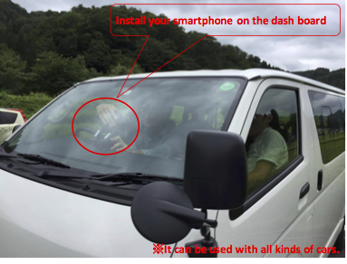
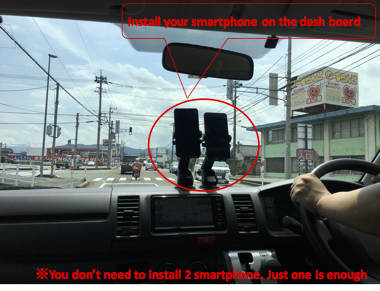

# RoadCrackDetector

## What is RoadCrackDetector?
RoadCrackDetector is a smartphone apps that detects damages on the road by utilizing deep neural network model.

スマートフォン上で深層学習モデルを動かすことで、道路路面の損傷画像を検出するアプリケーションです。

## How to use RoadCrackDetector?
### Basic Functions
- Detect Road Damages when the car is running
- Stop processing automatically when the car is stopping
- Record road images every 1 second

### Instalation location
- Car dashboard

## How to train the Crack Detection model?
(March 2017)
We used [yolo detector](https://pjreddie.com/darknet/yolo/ "yolo web") for training the model.
The training dataset is more than 30,000 road images including road damages..
This application can just detect "damages".

(September 2017)
We used SSD using MobileNet for training the model.
Trained model with 9,053 road images with damages can be accessed [here](https://s3-ap-northeast-1.amazonaws.com/mycityreport/trainedModels.tar.gz).
This application can just detect "damages" and classify "damage types".

### Android application
Apps with MobileNet+SDD(Octorber 2018)
[RoadCrackDetector.apk(26MB)](https://s3-ap-northeast-1.amazonaws.com/sekilab-students/maeda/kashiyama/mcr111_open.apk)
(Android 7.1 or higher is required)

The app saves 2 kinds of files in 'ExternalStorage/Android/data/org.utokyo.sekilab.mcr/files'.
Location file contains GPS coordinate every 3 seconds. Damage file contains road damage data and image data.

### Experiments in some local governments in Japan(August 2017)
We did road inspection with our apps in Toga villege, please check [our website](http://sekilab.iis.u-tokyo.ac.jp/archives/category/news#post-1882)!
You can also watch the movie in the experiment as a demo([demo movie](https://youtu.be/P74Hl0vr1-Y))

富山県の利賀村にて、本アプリケーションを用いて実際に路面点検を実施しました ([参考](http://sekilab.iis.u-tokyo.ac.jp/archives/category/news#post-1882))。 
実験の様子を[デモ動画](https://youtu.be/P74Hl0vr1-Y)として公開していますので、ご覧ください。

